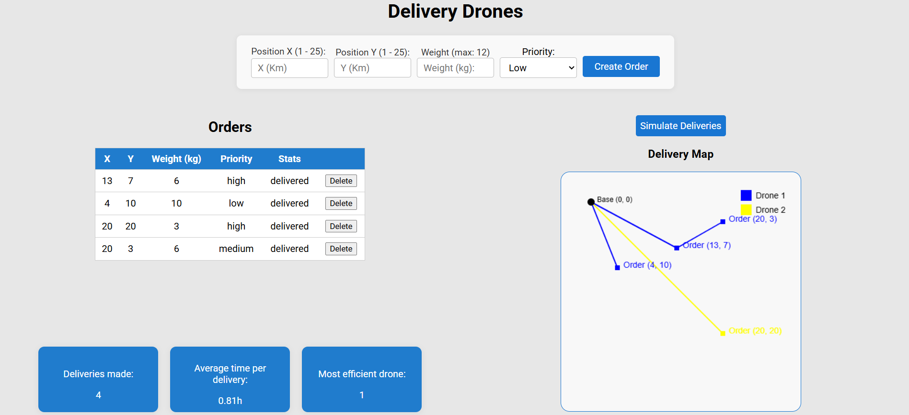
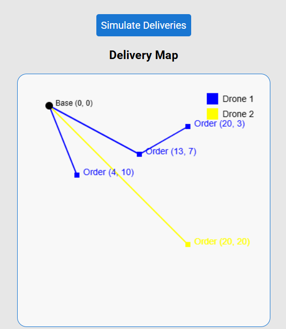

# Drone Delivery Simulator

Simulador de delivery por drones!

## Descrição

O projeto consiste em um simulador de entregas de pedidos com drones, com a eficiência baseada na prioridade, peso e distância de cada pedido!

O sistema conta com uma interface para realizar os pedidos e visualizar em um mapa (plano cartesiano) a trajetória de cada drone para entregar os pacotes. Depois de feita a simulação, o sistema trás um relatório sobre a quantidade de entregas realizadas, o tempo médio gasto por entrega e o drone mais eficiente.

Os pedidos pendentes e entregues ficam alocados em uma tabela, onde é possível visualizar suas especificações e deletá-los, se necessário.

## Tecnologias utilizadas

As tecnologias que foram utilizadas para esse projeto foram:

- Node.js (Express)
- React (com Vites)
- mySQL

## Como executar

### Passo 1

Se você não tem o mySQL instalado na sua máquina, você deve seguir os passos a seguir. Se você já tem essa ferramenta, pule para o passo 2.

#### 1.1 Instalar o mySQL installer:

🔗 https://dev.mysql.com/downloads/installer/

- Opte pelo Full Installer.

#### 1.2 Iniciar a instalação

- Execute o arquivo baixado (mysql-installer-community-...exe).

- Aparecerá o instalador com opções de setup:

- Developer Default — recomendado para quem vai desenvolver (instala: MySQL Server, Workbench, Shell,etc.)

- Ou Full que faz a intalação completa.

👉 Escolha “Developer Default” e clique em Next.

#### 1.3 Instalar os produtos selecionados

- O instalador mostrará uma lista (MySQL Server, Workbench, Connector, etc.).

- Clique em Execute → ele fará download e instalação de todos.

- Quando terminar, clique em Next.

#### 1.4 Configurar o mySQL Server

Agora vem a configuração do servidor MySQL:

##### a) Config Type

- Escolha: Standalone MySQL Server / Classic MySQL Replication

- Em seguida: Development Computer (menos uso de recursos)

##### b) Network

- Deixe a porta padrão: 3306

- Mantenha TCP/IP habilitado

- Clique Next

##### c) Authentication Method

- Escolha Use Strong Password Encryption (RECOMMENDED)
  (Caso o Node.js dê erro depois, podemos trocar para “Legacy” via Workbench, mas tente forte primeiro.)

##### d) Criar usuário root

- Defina uma senha para o usuário root. Ex: root123
- Clique Next

##### e) Windows Service

- Marque Configure MySQL Server as a Windows Service

- Nome: MySQL80 (padrão)

- Marque Start MySQL Server at System Startup

- Escolha Run as Standard System Account

- Clique Next.

##### f) Apply Configuration

- Clique Execute e aguarde concluir todos os passos.
- Clique em Finish.

##### g) Connect to Server

- Insira a senha que você definiu
- Clique em Check e então em Next

Dependendo da versão haverão algumas configurações a mais para ser feitas, mas essas podem ser concluídas clicando em Next apenas.

Pronto! Seu servidor estará pronto para o projeto.

### Passo 2

Depois de ter o mySQL instalado. Clone o repositório do projeto e escreva o seguinte comando no terminal da pasta /server para adaptar as variáveis de ambiente do banco de dados à sua máquina:

Para Linux / macOS / Windows Powershell:

```bash
cp .env.example .env
```

Para Windows CMD:

```bash
copy .env.example .env
```

Então, entre no arquivo .env e altere o que for necessário, como o usuário e senha do seu mySQL.

ATENÇÃO: Se você não configurou uma senha para o usuário do mySQL deixe o campo password vazio: remova "yourpassword". Porém, se você criou uma senha para esse usuário, coloque-a no campo "DB_PASSWORD=".

### Passo 3

Instale os módulos do back-end e então inicie o servidor com os respectivos comandos:

```bash
npm install
node src/index.js
```

### Passo 4

Mantenha esse terminal aberto e abra outro na pasta /client, e então instale também os módulos e inicie a página web:

```bash
npm install
npm run dev
```

### Passo 5

Então tudo estará pronto e você poderá clicar no link que aparecerá no terminal ou então escrever no seu navegador:

```bash
http://localhost:5173/
```

## Como simular as entregas

Para simular as entregas, preencha o formulário com alguns pedidos, obedecendo as especificações de cada valor.

A cada pedido que for digitado, clique em "Create Order" e ele irá para a tabela de pedidos. Se algum pedido foi criado de forma incorreta, aperte no botão "delete" para deletá-lo.

Após criar alguns pedidos, clique no botão "Simulate Deliveries" para simular as entregas. Então você verá todas as entregas feitas por cada drone no mapa.

### Sobre a lógica do projeto

Lógica de alocação drones <-> pedidos:

1.  Ordena pedidos por prioridade (high, medium, low) e depois por criação.
2.  Para cada drone (ordenados por capacidade decrescente), monta rotas "viagem" agrupando pedidos. O pedido é válido enquanto o peso total <= capacidade e rota estimada <= autonomia.

3.  Rota estimada: baseada em distância euclidiana para calcular a distância da rota

4.  Drones iniciam na base (0,0) visitando os pontos selecionados e então retornam à base.

Drones disponíveis:

No projeto existem três drones com diferentes características:

- Drone 1: capacidade de 12kg e autonomia de 50 Km;
- Drone 2: capacidade de 10kg e autonomia de 80 Km;
- Drone 3: capacidade de 7kg e autonomia de 60 Km;

## Desenvolvimento com IAs

O projeto foi desenvolvido, em sua maioria com o auxílio de IAs. Assim, tudo pôde ser criado e otimizado com muito mais eficiência e velocidade, mantendo a qualidade!

### Como foram utilizados as IAs

Para desenvolver o sistema, utilizei as IAs de duas formas:

- Para criar a base lógica e estrutural das partes front e back-end do projeto (com Chat GPT 5 e 4)
- Para me auxiliar na implementação de funções especificas, correção de erros, novas funcionalidades e etc. (com Github Copilot)

#### Back-end

Ou seja, primeiro foi feito um prompt inicial, baseado em fundamentos da engenharia de prompt, onde toda descrição deve conter uma persona, um contexto, um objetivo, um modelo, e um resultado. Sendo assim o primeiro prompt foi esse:

"Sou um desenvolvedor de software e preciso da sua ajuda para criar um simulador que gerencia as entregas, drones e seus respectivos voos de uma empresa de logística, respeitando regras de capacidade, distância e prioridade de entrega.

Regras Básicas
Cada drone deve suportar até um certo peso (kg) e pode viajar até uma certa distância até voltar a base.
A cidade deve ser uma malha 2D, como um plano cartesiano, onde as posições são definidas por X e Y.
Os pedidos vão conter: peso, localização (X, Y) e prioridade (alta, média e baixa)

Com isso, o sistema deve calcular os melhores pedidos para cada drone, para que o menor número de viagens seja necessário para entregar os pedidos.

Quero o resultado mostrando cada arquivo de código de toda a estrutura, utilizando as tecnologias Node.JS, Express, CSS, React e mySQL.

o front end deve conter:

- Quantidade de entregas realizadas
  • Tempo médio por entrega
  • Drone mais eficiente
  • Mapa das entregas (gráfico)."

Com isso, o Chat GPT 5, me entregou toda a base do projeto. Mas analisando a estrutura, as partes que me foram proveitosas foi o back-end e a estrutura do banco de dados, pois o front-end gerado não estava de acordo com minhas ideias e o objetivo do projeto.

Com a estrutura passada para dentro do VS Code. Analisei o que parecia errado e o que estava faltando para trazer um resultado mais completo e dei início às implemetações. Com o auxilio do GitHub Copilot, fiz várias alterações que deram bons resultados, por exemplo:

- Pedidos que mesmo após entregues continuavam com o status assigned, alterei para que ficassem como delivered se entregues, ou undelivered se nenhum drone tiver autonomia o suficiente para entregar o pedido.

- Adicionei os endpoints GET orders e DELETE order:
  - GET orders mostra todos os pedidos já feitos,
  - DELETE order deleta um pedido baseado no id dele.

Para o back-end esses foram os principais pontos do desenvolvimento.

#### Front-end

Já para o front-end, um outro prompt principal foi utilizado para criar toda a estrutura dos componentes, mapa, app, etc. Seguindo a mesma lógica da primeira parte. No entanto, dessa vez utilizei a funcionalidade de Projeto do Chat GPT, onde é possível enviar arquivos para contextualizar a resposta da IA. Escolhi os 5 arquivos mais importantes para a criação do front-end e escrevi o seguinte prompt:

"Sou desenvolvedor e tenho esse projeto de delivery com drones, preciso de um front-end para esse projeto que mostre os seguintes aspectos do projeto:

- Quantidade de entregas realizadas
  • Tempo médio por entrega
  • Drone mais eficiente
  • Mapa das entregas (gráfico)

o projeto possui 4 endpoints e preciso que o front-end considere cada um:

- router.post("/orders", postOrder) - É a rota que cria um pedido,

- router.get("/orders", listOrders); - Rota que pega todos os pedidos já feitos

- router.delete("/orders/:id", deleteOrder);- Deleta o pedido pelo ID

- router.get("/simulate", simulate); - Simula as entregas e devolve o que cada drone entregou, quanto tempo gastou, quantos Km's percorreu etc.

Crie para mim a estrutura e os arquivos para um front-end com react que sirva como uma interface para visualizar, criar pedidos e simular o sistema."

Após criada essa base, a maior parte dos ajustes feitos com o GitHub Copilot foi para criar um mapa bem legível e compreensível com todas as informações necessárias. O resto das criações, implementações e correções foram mais intervenções diretas minhas sobre o código, como na organização e estilização dos componentes na página e como seriam mostrados os pedidos.

## Imagens do projeto

### Dashboard:

Link de demonstração de simulação: https://drive.google.com/file/d/1DSGkByZ9VMRtMhfUNgSHw4KjMdPFzTto/view?usp=sharing



### Mapa de entregas:



## Licença

MIT License
